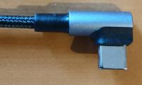
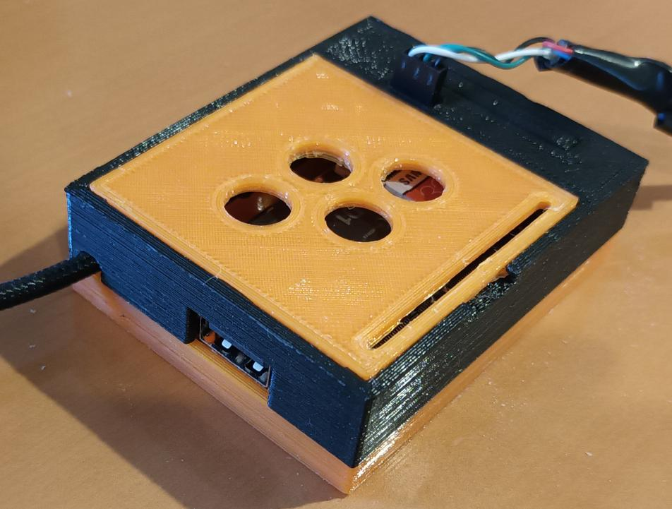
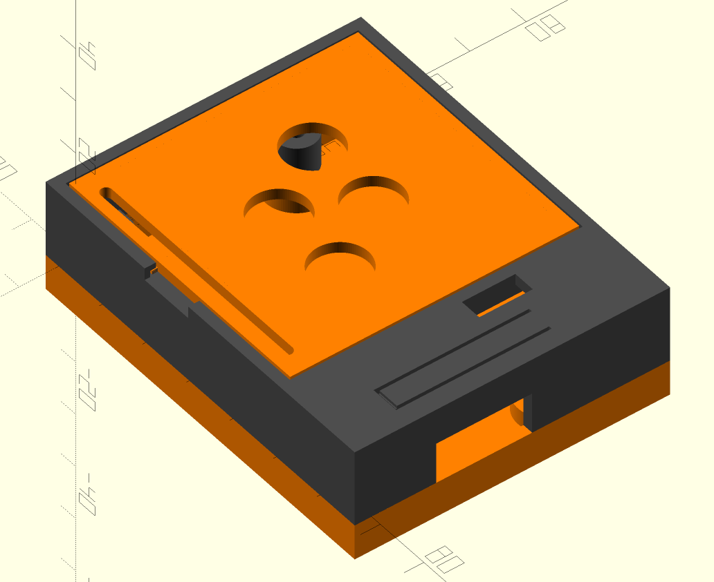

Case for LicheeRV board
=======================

The repository contains the OpenSCAD file and the STL files for the case in
the images below.

You will need an M3 thread cutter for mounting the board with M3x8mm screws.

Usage of an angled USB power cable is assumed.

License
-------

Creative Commons Attribution-ShareAlike 4.0 International Public License
(CC BY-SA 4.0)

Details see https://creativecommons.org/licenses/by-sa/4.0/
